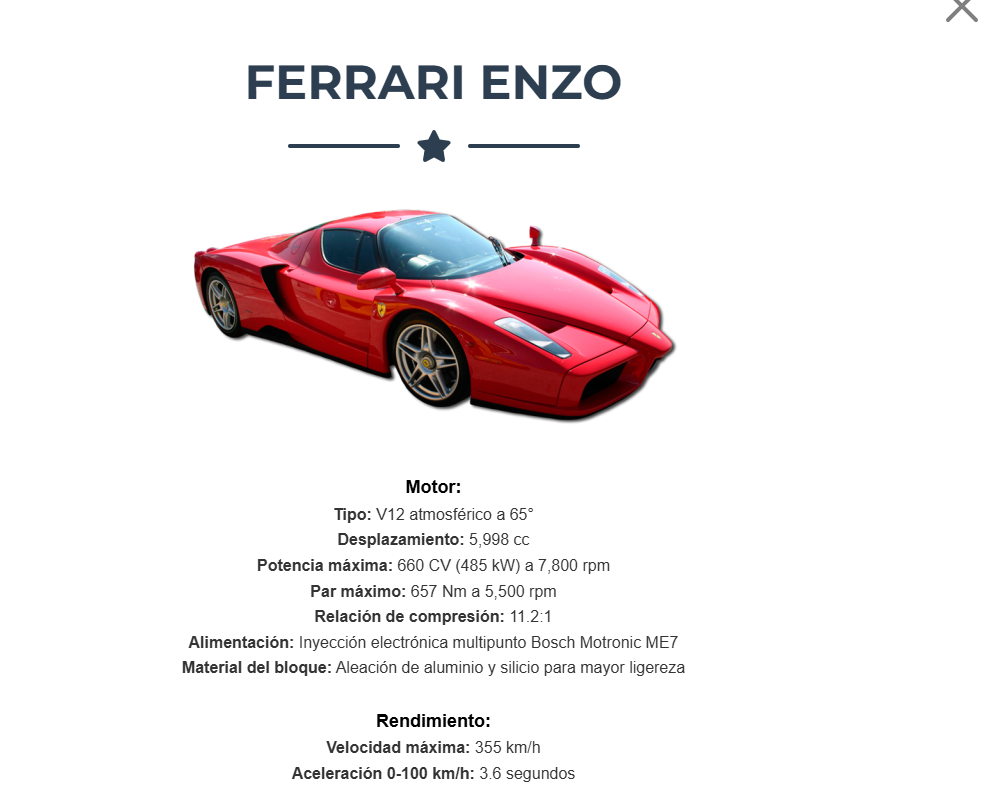
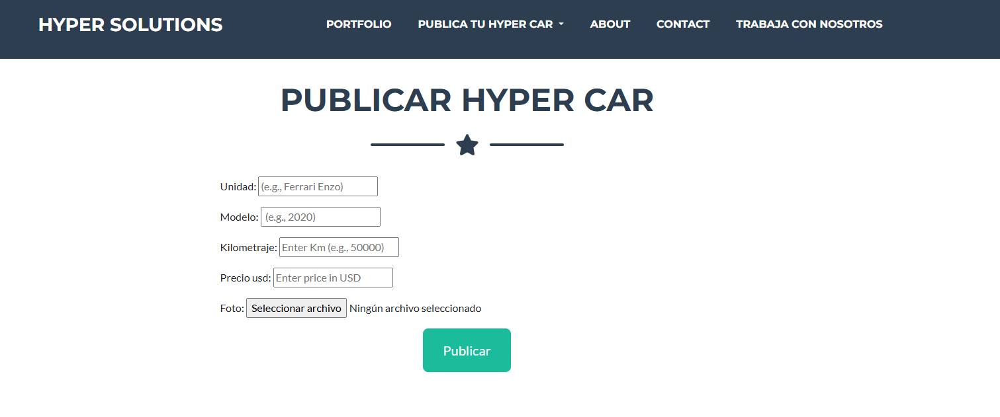
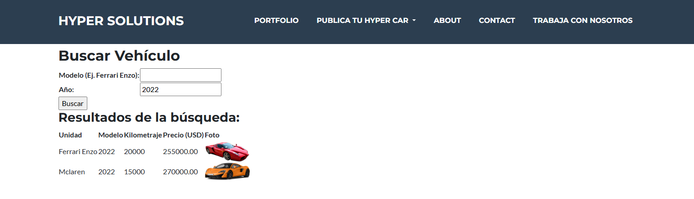

# Arandiga_Proyecto

**15/12 17:45hs (Requerimientos cumplidos)**

El proyecto consta de una página de superautos.

## Estructura del Proyecto

### Navegación Principal

1. **[Portfolio/Home](http://127.0.0.1:8000/APP/inicio/):**  
   Es la pestaña de inicio, donde se muestra una lista de los autos en cartera. Actualmente, la Ferrari Enzo es la única desarrollada. Puedes hacer clic en el auto para ver una descripción detallada de la unidad.
   
   

2. **[Publica tu Hyper Car](http://127.0.0.1:8000/APP/publicar_rodado/):**  
   Aquí puedes publicar tu auto adjuntando los detalles y una foto.
   
   

3. **[Autos ya en Agencia](http://127.0.0.1:8000/APP/buscar-vehiculo/):**  
   En esta sección, puedes buscar autos ya cargados en la agencia por clientes. El buscador permite filtrar por modelo y año.
   
   Además, se desarrolló una funcionalidad para renderizar las imágenes de los autos cargados por los clientes.
   
   

4. **[ABOUT](http://127.0.0.1:8000/APP/acercade/):**  
   Esta sección contiene una descripción de la empresa.

5. **[CONTACT](http://127.0.0.1:8000/APP/formulario/):**  
   Formulario de contacto (Formulario 2/3).

6. **[TRABAJA CON NOSOTROS](http://127.0.0.1:8000/APP/publicar_cv/):**  
   Formulario donde los interesados pueden cargar su CV y datos para trabajar en la empresa (Formulario 3/3).

### Footer

En el footer se agregó un enlace a mi perfil de LinkedIn.
